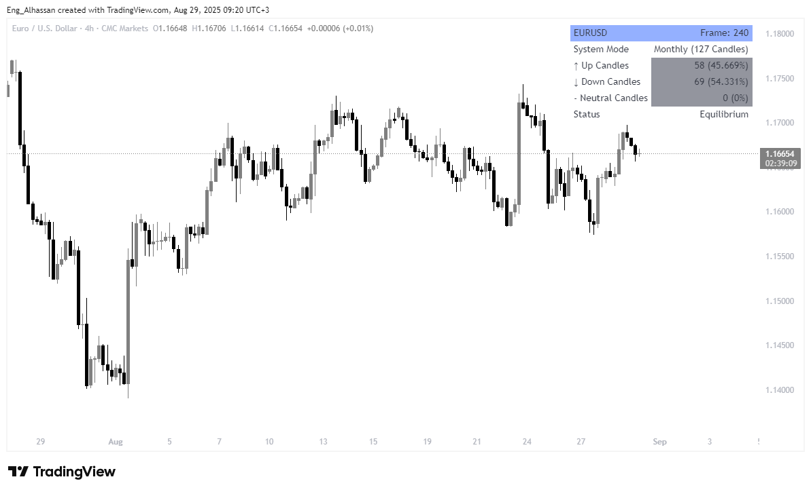
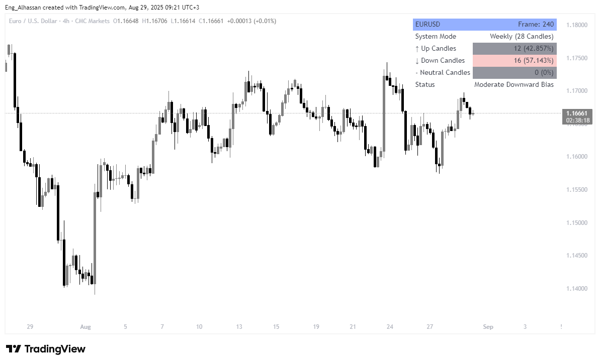

# QuantMarket Lab: Directional Dashboard

An advanced statistical analysis tool for TradingView that shifts focus from price-following signals to diagnosing the market's fundamental character and directional equilibrium.

---

## Table of Contents

1.  [The Philosophy: Beyond Price, Towards Statistical Truth](#1-the-philosophy-beyond-price-towards-statistical-truth)
2.  [Key Features](#2-key-features)
3.  [Showcase: The Indicator in Action](#3-showcase-the-indicator-in-action)
4.  [The Dashboard: Deconstructing the Analysis Layers](#4-the-dashboard-deconstructing-the-analysis-layers)
5.  [Professional Application: Identifying Regimes & Anomalies](#5-professional-application-identifying-regimes--anomalies)
6.  [Target Audience & Use Case](#6-target-audience--use-case)
7.  [Installation](#7-installation)
8.  [Connect with the Author](#8-connect-with-the-author)
9.  [Contributing](#9-contributing)
10. [Legal Disclaimer](#10-legal-disclaimer)
11. [License](#11-license)

## 1. The Philosophy: Beyond Price, Towards Statistical Truth

Inspired by Burton Malkiel's "A Random Walk Down Wall Street" and the Efficient Market Hypothesis, this indicator is built on a simple yet profound premise: in an efficient market, the probability of an asset closing UP on any given day is roughly equal to the probability of it closing DOWN. This suggests a near **50/50 statistical equilibrium** in the *frequency* of directional days, a principle this tool is designed to monitor.

Unlike traditional indicators that chase price, the Directional Dashboard acts as a diagnostic lab. It doesn't ask "Where is the price going?" but rather, "What is the market's underlying statistical personality right now?".

> It is designed to answer critical questions:
>
> - Is the market in a state of statistical balance, suggesting range-bound behavior?
> - Is there a genuine, persistent directional bias, indicating a strong trend?
> - Has the current session (daily, weekly) reached a point of statistical exhaustion, hinting at a potential reversal?

This approach provides an objective, data-driven layer to a trader's analysis, offering a stable statistical compass in the chaotic sea of price fluctuations.

## 2. Key Features

- **Multi-Mode Analysis:** Switch between a long-term **Standard** (rolling lookback) mode and tactical **Session** modes (Daily, Weekly, Monthly) to analyze both strategic character and short-term mood.
- **Statistical Diagnosis:** Provides clear, quantifiable data on directional frequency, moving beyond subjective interpretation.
- **Data Validity Filter:** Includes a "Minimum Candles" threshold to prevent premature analysis based on insufficient data at the start of a new session.
- **Context-Aware Dashboard:** The display intelligently adapts to show the most relevant information for the selected mode.
- **Universal & Fractal:** The core logic applies to all markets and timeframes, revealing the fractal nature of market equilibrium.

## 3. Showcase: The Indicator in Action

The indicator's power lies in its ability to reveal the market's hidden statistical structure. The following screenshots were captured on **Friday, August 29, 2025**.

*(Note: Please ensure your image files in the `TradingView_Indicator/pic/` directory match these names.)*

### 1. Dow Jones Industrial Average (DJI) on the Weekly Chart

* **Analysis Mode:** Standard (Lookback Period)
* **Parameters:** 522 Candles (representing 10 years of weekly data)
* **Diagnosis:** Moderate Upward Bias
* **Analytical Summary:** Over a long-term 10-year period, the Dow Jones index exhibits a clear and persistent bullish character on the weekly timeframe, with significantly more weeks closing higher than lower.

### 2. U.S. Dollar Index (DXY) on the Daily Chart

* **Analysis Mode:** Standard (Lookback Period)
* **Parameters:** 252 Candles (representing approximately 1 trading year)
* **Diagnosis:** Equilibrium
* **Analytical Summary:** Over the past trading year, the U.S. Dollar Index demonstrates a near-perfect statistical equilibrium. This balance indicates a market lacking a persistent directional bias, characteristic of a ranging or highly efficient market environment.

### 3. EUR/USD on the 15-Minute Chart (Daily Session Mode)

* **Analysis Mode:** Daily Session
* **Parameters:** 38 Candles (candles formed so far in the current day)
* **Diagnosis:** Equilibrium
* **Analytical Summary:** Analyzing the current trading day's session, the EUR/USD shows a state of equilibrium. Despite a slight numerical advantage for bearish candles, the overall balance of power remains neutral, indicating a lack of decisive intraday momentum so far.

### 4. EUR/USD on the 4-Hour Chart (Monthly Session Mode)

* **Analysis Mode:** Monthly Session
* **Parameters:** 127 Candles (candles formed so far in the current month)
* **Diagnosis:** Equilibrium
* **Analytical Summary:** For the current trading month, the EUR/USD on the 4-hour chart shows a slight statistical advantage to sellers. However, this is not strong enough to constitute a directional bias, leading to a correct diagnosis of an "Equilibrium" market character.

### 5. EUR/USD on the 4-Hour Chart (Weekly Session Mode)

* **Analysis Mode:** Weekly Session
* **Parameters:** 28 Candles (candles formed so far in the current week)
* **Diagnosis:** Moderate Downward Bias
* **Analytical Summary:** For the current trading week, the EUR/USD is exhibiting a clear bearish character. With sellers controlling over 57% of the sessions, the indicator correctly identifies a "Moderate Downward Bias," providing a valuable tactical insight.

### 6. GBP/USD on the 1-Minute Chart (Monthly Session Mode)

* **Analysis Mode:** Monthly Session
* **Parameters:** 6,287 Candles (candles formed so far in the current month)
* **Diagnosis:** Equilibrium
* **Analytical Summary:** This example showcases the robustness of the equilibrium theory even on a high-frequency timeframe. Over thousands of one-minute candles, the GBP/USD demonstrates a clear state of statistical balance.

### 7. Gold Futures (GC1!) on the Daily Chart

* **Analysis Mode:** Standard (Lookback Period)
* **Parameters:** 100 Candles (representing 100 trading days)
* **Diagnosis:** Equilibrium
* **Analytical Summary:** A textbook example of perfect statistical balance. Over the last 100 trading days, Gold Futures have shown an exact 50/50 split between up and down days, powerfully illustrating the core concept of market equilibrium.

### 8. Nasdaq 100 Index (NDX) on the Monthly Chart

* **Analysis Mode:** Standard (Lookback Period)
* **Parameters:** 100 Candles (representing 100 months, over 8 years of data)
* **Diagnosis:** Moderate Upward Bias
* **Analytical Summary:** This example demonstrates the indicator's ability to identify long-term structural trends. The Nasdaq 100 shows a strong bullish bias over the last 100 months, capturing the powerful bull market in the tech sector.

## 4. The Dashboard: Deconstructing the Analysis Layers

The dashboard is designed for clarity and immediate insight. Each row serves a specific analytical purpose.

| # | Metric | Technical Breakdown | Practical Significance |
|---|---|---|---|
| 1 | **Header** | Displays the current Ticker and Chart Timeframe. | Provides immediate orientation and context. |
| 2 | **System Mode** | **The Smart Row:** In `Standard` mode, shows the fixed lookback period. In `Session` mode, displays the mode (e.g., Daily) and the number of candles analyzed so far. | **What data am I looking at?** This critical row eliminates all ambiguity about the scope of the analysis. |
| 3 | **Up Candles** | **Bullish Frequency:** Displays the count and percentage of candles where `close > open`. | **How persistent is buying pressure?** A consistently high percentage (>55%) indicates a strong, trending environment. |
| 4 | **Down Candles** | **Bearish Frequency:** Displays the count and percentage of candles where `close < open`. | **How persistent is selling pressure?** Quantifies the strength and consistency of bearish sentiment. |
| 5 | **Neutral Candles** | **Indecision Meter:** Counts candles where `close == open`. | **Is the market pausing?** A rising number can signal market indecision, often preceding a volatile move. |
| 6 | **Status** | **Diagnostic Summary:** Provides a simple text description of the market's statistical state (e.g., `Equilibrium`, `Moderate Upward Bias`). | **What's the final verdict?** Gives a quick, human-readable summary of the numerical data. |

## 5. Professional Application: Identifying Regimes & Anomalies

The mastery of this indicator lies in using it to identify the market's current **regime** and spot **anomalies**.

### Scenario 1: Identifying a "Ranging" Regime
When the indicator is in **Standard Mode** and the `Up/Down` percentages are consistently hovering between **45% - 55%**, it is a powerful, objective confirmation that the market is in a range-bound or "choppy" state.
> **Practical Application:** In this regime, trend-following strategies are likely to fail. A trader should prioritize mean-reversion strategies.

### Scenario 2: Identifying a "Trending" Regime
When the percentages show a clear and persistent directional bias (e.g., `Up Candles` consistently above **60%**), it confirms the existence of a strong, healthy trend.
> **Practical Application:** This provides high conviction for entering or holding trades in the direction of the trend and acts as a filter to confirm breakouts.

### Scenario 3: Spotting "Session Exhaustion" Anomaly
When a **Session Mode** (e.g., `Daily`) shows an extreme reading (e.g., `Down Candles` reaches **85%**), it signals that the selling pressure for that session may be statistically over-extended and vulnerable to a reversal.
> **Practical Application:** This is a valuable signal for mean-reversion traders looking for tactical, counter-trend opportunities.

## 6. Target Audience & Use Case

This tool is designed for the serious trader who seeks an objective, statistical layer for their decision-making.

- **Discretionary Traders:** Use it as a "market compass" to confirm that their trade idea aligns with the market's underlying statistical character.
- **Systematic Traders:** Use it as a powerful regime filter to turn their strategies on or off based on whether the market is trending or ranging.

## 7. Installation

1.  Open [TradingView](https://www.tradingview.com/) and navigate to the **Pine Editor** tab.
2.  Clear any existing code.
3.  Copy the entire code from the `.pine` script file in this project's repository.
4.  Paste the code into your Pine Editor.
5.  Click **"Save"** and then **"Add to Chart"**.

## 8. Connect with the Author

Connect with **Eng. Alhassan Ali Mubarak Bahbah** for feedback, questions, or collaboration.

- [**GitHub**](https://github.com/EngAlhassan404)
- [**Twitter/X**](https://twitter.com/EngAlhassan404)
- [**Instagram**](https://www.instagram.com/k_.x_o/)
- [**Linkedin**](https://www.linkedin.com/in/eng-alhassan-ali-bahbah-a6620231b)

## 9. Contributing

Contributions are welcome! If you have ideas for improvements or bug fixes, please open an issue or submit a pull request.

## 10. Legal Disclaimer

This indicator is provided for educational and analytical purposes only. It is not financial advice. Trading involves substantial risk. Under no circumstances should this tool be construed as a recommendation to buy or sell any financial asset. All decisions are your own and at your own absolute risk. Please consult with a qualified financial advisor before making any investment decisions.

## 11. License

This project is licensed under the **MIT License**.
